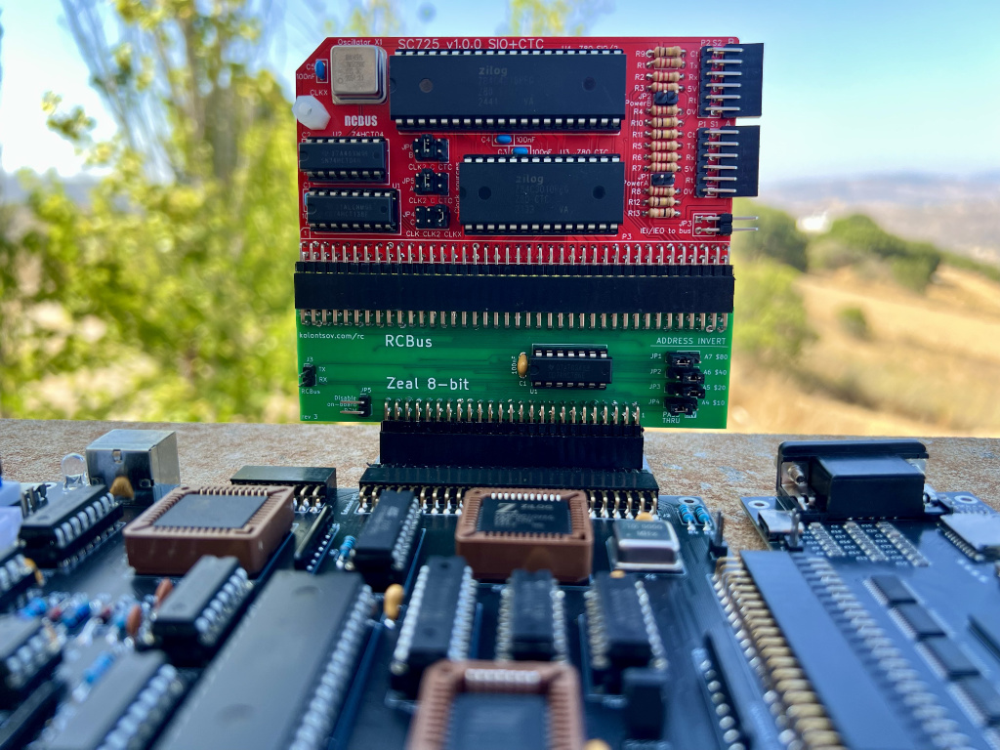
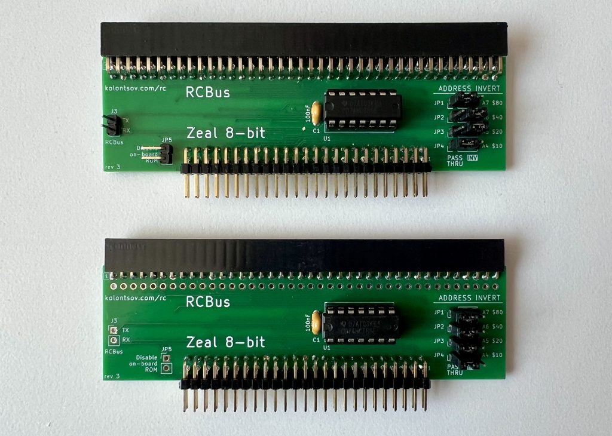

## Zeal 8-bit to RCBus adapter

This is a simple adapter enabling the use of RC2014 and [RCBus](https://smallcomputercentral.com/rcbus/) boards with the [Zeal 8-bit computer](https://zeal8bit.com/) [external port](https://zeal8bit.com/docs/ext_port/) or [backplane](https://www.tindie.com/products/zeal8bit/backplane-pcb-for-zeal-8-bit-computer-4-slots/), with optional port mapping.

Port mapping is important because many RCBus boards use ports larger than 0x80, which is [reserved I/O space](https://zeal8bit.com/docs/memorymap/#io-mapping) on the Zeal 8-bit computer.

To make the board compatible with Zeal 8-bit, any of the A7-A4 address lines can be **inverted** -- see [online configuration tool](https://kolontsov.github.io/zeal8bit-rcbus/).

Tested with:
- [SC729 – RCBus Compact Flash Module](https://smallcomputercentral.com/rcbus/sc700-series/sc729-rcbus-compact-flash-module/) (with [Zeal 8-bit OS](https://github.com/Zeal8bit/Zeal-8-bit-OS))
- [SC725 – RCBus Serial and Timer Module](https://smallcomputercentral.com/rcbus/sc700-series/sc725-rcbus-serial-and-timer-module/) (with RomWBW)
- [16C2552 dual UART for RC2014](https://hackaday.io/project/170819-16c2552-dual-uart-for-rc2014) (with RomWBW)
- (to be added)

No guarantee that it will work with other RCBus boards, but it should be compatible with most of them.

### Bill of Materials

Reference | Description                                    | Comment
--------- | ---------------------------------------------- | --------------------------------------
J1        | 2x25 pin header, 2.54 mm, right angle          | Plugs into Zeal 8-bit backplane
J2        | 2x40 *or* 1x40 pin socket, 2.54mm, right angle | Socket for RCBus board to plug into
JP1, JP2, JP3, JP4 | 2-pin header                          | A7-A4 invert jumpers
U1        | 74HCT86 (DIP-14), with optional socket         | Quad 2-input XOR gate
C1        | 0.1µF ceramic capacitor                        |
JP5       | 2-pin header, 2.54mm                           | (optional) Disable Zeal 8-bit on-board ROM
J3        | 2-pin header, 2.54mm                           | (optional) RX/TX pins of RCBus

### PCB

- Gerber files are in [production/](production/) directory
- Schematics in PDF format: [zeal8bit-rcbus.pdf](docs/zeal8bit-rcbus.pdf)
- KiCad 9.0 project in this directory

### Assembly

In most cases, using a 40-pin socket for connecting RCBus boards is sufficient and easier to use than an 80-pin socket, especially if you need to connect and disconnect frequently.

An 80-pin socket is only required if your RCBus board actually uses the NMI, WAIT, BUSRQ, BUSACK, HALT or A16..A21 lines.

### Configuration

Use the [online configuration tool](https://kolontsov.github.io/zeal8bit-rcbus/) to determine which address lines (A7-A4) need inversion for your specific RCBus board. Set jumpers JP1-JP4 accordingly.

### License

Licensed under [CERN-OHL-P v2](LICENSE).

All trademarks are the property of their respective owners, use of these names does not imply endorsement.
